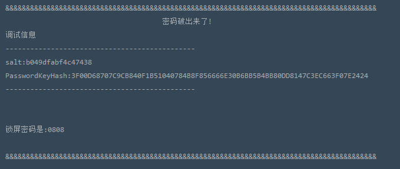
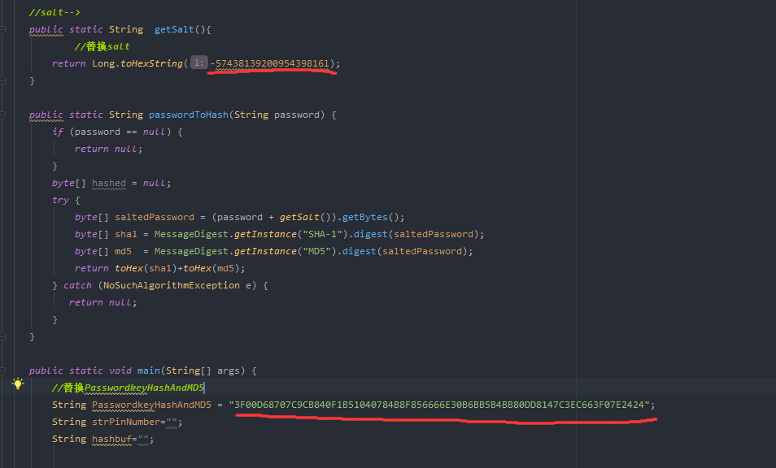
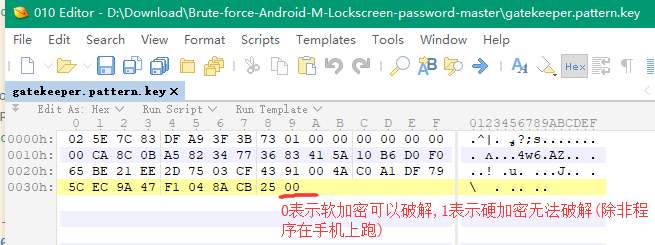

# **AndroidPin-Crack** #

------------------------------------------------------------------------------

破解安卓6.0锁屏密码 手势密码、 PIN密码 、字符数字组合密码的python 脚本

破解安卓6.0以下(不包含6.0)锁屏密码、手势密码、PIN密码、字符数组组合密码 Java工程

作者 Lee  @pinghang.com.cn [平航科技 专业取证 技术领先!]

------------------------------------------------------------------------------

### **Android 6.0以下(不包含安卓6)锁屏密码暴力破解** ###

##### 1、Screenshot

##### 2、Usage
安卓6.0以下破解需要在手机系统里面提取两个文件(Password.key、Locksettings.db) 默认在/data/data/system 下面

>用sqlite数据库管理软件(我这里用的是[SqliteSpy++](http://dl.pconline.com.cn/download/765800.html) ),打开locksettings.db文件,找到lockscreen.password_salt 这一行,将数值复制出来.我这里是(-5743813920095439816)
>记作：` salt:-5743813920095439816l `   **<------注意尾部 要加上l(小写的L)**

>用记事本打开pasword.key文件,如果无法打开就把后缀名更改为 "password.key.txt",打开后内容如下
>记作：`PasswordkeyHashAndMD5:3F00D68707C9CB840F1B51040784B8F856666E30B6BB5B4BB80DD8147C3EC663F07E2424 `

>用Android Studio或Idea 导入本工程,搜索关键字 `替换salt` 、`替换PasswordkeyHashAndMD5`
>将源码中的salt和PasswordkeyHashAndMD5 替换成自己的即可!

------------------------------------------------------------------------------

### **Android 6.0(不包含硬加密)锁屏密码暴力破解** ###

##### 1、Screenshot

##### 2、Usage

破解Android6.0锁屏密码方法，提取出手机系统里面的 `gatekeeper.pattern.key` 目录大概是data/system/gatekeeper.pattern.key
>gatekeeper.password.key **(数字密码)**  
>gatekeeper.pattern.key **(手势密码)**  

#### **！！！！！！！！！！！！！！！！需要注意的一点！！！！！！！！！！！！！！！！！**
**如果最后面是01的话暂时不能用这种方式破解,需要在手机上进行暴力破解，以后我将会更新。**

将提取出来的 `gatekeeper.patter.key` 与 `bruteforce-m-lockscreenpwd.py`放同一目录，最后执行如下命令即可!

>运行本脚本,直接使用python即可  
>python bruteforce-m-lockscreenpwd.py

##### 3、Dependencies
 1. [scrypt](pip install scrypt)
 2. [hashlib](pip install hashlib)
